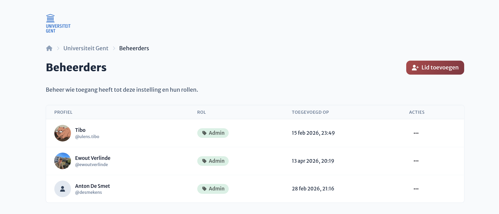
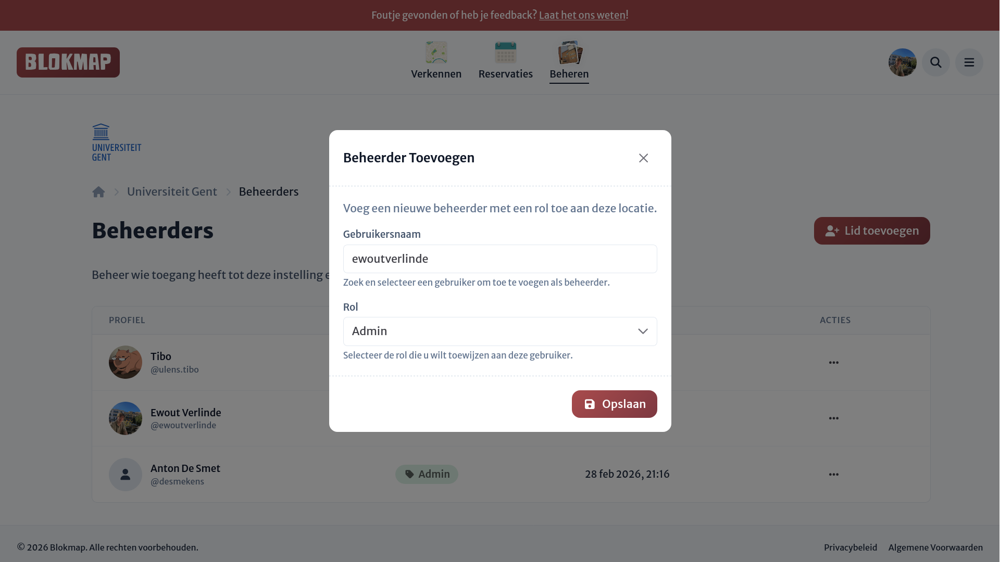

# Toegangsbeheer

Binnen organisaties kan je, net zoals bij [locaties](../../locations/access/), organisatiebeheerders met hun bijbeheronde rollen en rechten bekijken en aanpassen.

## Beheerders toevoegen, aanpassen en verwijderen

:::tip
Beheerders voor organisaties werken op exact dezelfde manier als bij locaties, met het enige verschil dat er extra permissies zijn die je kunt toewijzen aan een rol.
:::

Vanaf het overzicht kun je moeiteloos nieuwe personen als beheerder toevoegen. Via de knop rechtsboven open je een dialoogvenster:

1. **Zoeken**: Je kunt direct zoeken op de gebruikersnaam van de persoon binnen Blokmap.
2. **Rol toewijzen**: Ken direct een specifieke rol toe, of laat dit veld leeg als je de persoon later een rol wil geven.

