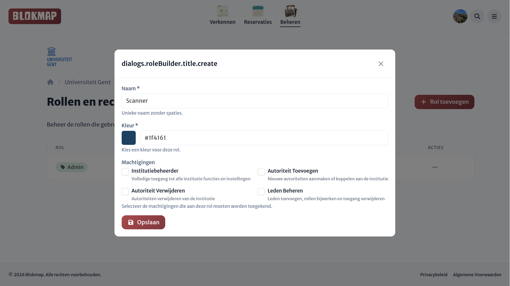

# Rollen & Rechten

:::tip
Rollen voor organisaties werken op exact dezelfde manier als bij locaties, met het enige verschil dat er extra permissies zijn die je kunt toewijzen aan een rol.
:::

Binnen organisaties kan je, net zoals bij [locaties](../../locations/access/roles.md), de rollen beheren die je wilt geven aan een beheerder.

Voor verdere informatie omtrent rollen en rechten verwijzen we naar de documentatie over [rollen en rechten op locaties](../../locations/access/roles.md).

::: info Work in progress
Het systeem voor de gedetailleerde (daadwerkelijke) rechten wordt momenteel herwerkt en is voorlopig nog _work in progress_.
:::
