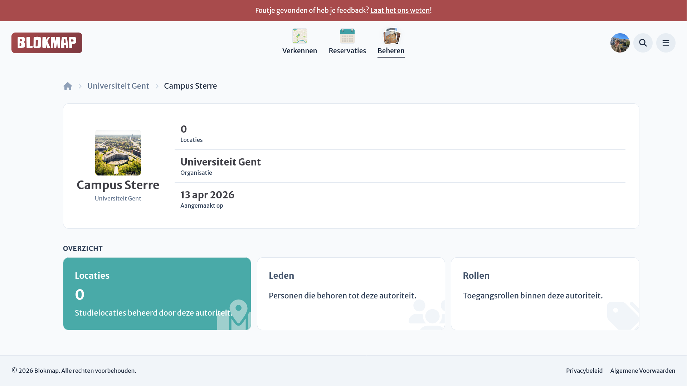
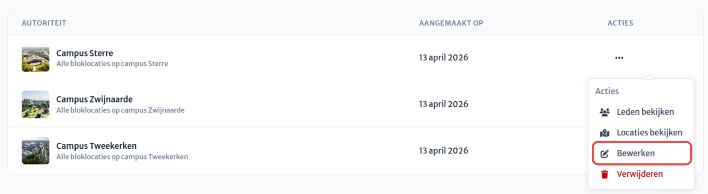

# Locatiegroepen beheren

Net zoals bij [locaties](../../locations/location-dashboard.md) en [organisaties](../index.md) heb je ook een dashboard voor locatiegroepen.

Hier vind je snel alle locaties onder de groep en de instellingen voor toegangsbeheer binnen de groep.

## Een locatiegroep bewerken

Vanuit het dashboard voeg je makkelijk een afbeelding toe aan de groep, of vervang je de bestaande afbeelding.
Deze afbeelding maakt het makkelijker de groep te onderscheiden van andere op overzichtpagina's.

De naam en beschrijving van een groep kunnen worden aangepast via het groepenoverzicht binnen een organisatie. Gebruik hiervoor de actieknop in de tabel bij de betreffende groep:

## Rollen & Rechten
