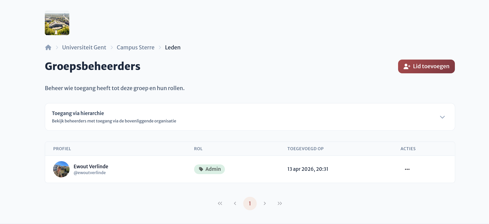

# Rollen & Rechten

:::tip
Rollen voor locatiegroepen werken op exact dezelfde manier als bij locaties en organisaties, met het enige verschil dat er extra permissies zijn die je kunt toewijzen aan een rol.
:::

Binnen organisaties kan je, net zoals bij [locaties](../../locations/access/roles.md), de rollen beheren die je wilt geven aan een beheerder. Hier kan je opnieuw beheerders toewijzen aan de groep met een specifieke rol.

:::tip Voorbeeld
Je kan een rol “Scanner” aanmaken en toewijzen aan vrijwilligers, zodat zij voor alle locaties op campus Sterre reservaties kunnen bevestigen en beheren. Dankzij deze groepsgewijze toewijzing hoef je dit niet per locatie afzonderlijk in te stellen.
:::

Voor verdere informatie omtrent rollen en rechten verwijzen we naar de documentatie over [rollen en rechten op locaties](../../locations/access/roles.md).

::: info Work in progress
Het systeem voor de gedetailleerde (daadwerkelijke) rechten wordt momenteel herwerkt en is voorlopig nog _work in progress_.
:::
