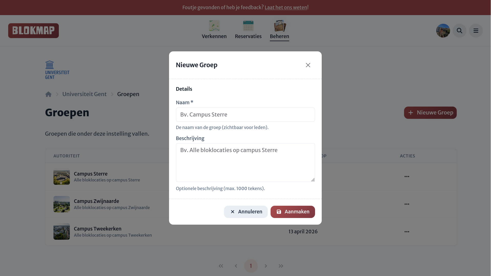

# Locatiegroepen

Voor grotere instituties met veel bloklocaties is er ook de mogelijkheid om bloklocaties onder te verdelen in **locatiegroepen**.

:::tip Voorbeeld
Een hogeronderwijsinstelling kan bloklocaties organiseren per campus door gebruik te maken van locatiegroepen.

Neem bijvoorbeeld de campus “Sterre”. Binnen deze campus zijn meerdere gebouwen en lokalen beschikbaar als bloklocaties tijdens de blokperiode. Door deze locaties onder te brengen in één locatiegroep, wordt het beheer overzichtelijker en efficiënter.

[Toegangsbeheer kan vervolgens op groepsniveau worden ingesteld](./authority-dashboard.md). Beheerders die aan deze locatiegroep worden gekoppeld, krijgen automatisch toegang tot alle onderliggende locaties, in overeenstemming met de permissies van hun rol.
:::

## Groep aanmaken

Kies een naam en een korte beschrijving voor de nieuwe groep. Achteraf kan je optioneel ook een afbeelding kiezen voor de groep, zie [groepen beheren](./authority-dashboard.md).

