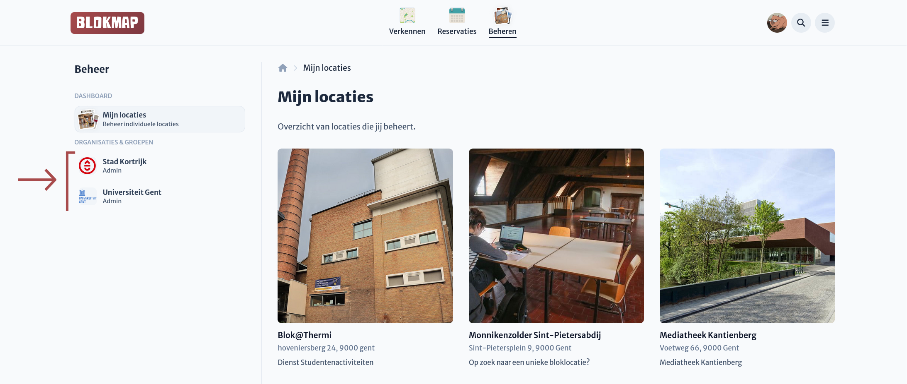
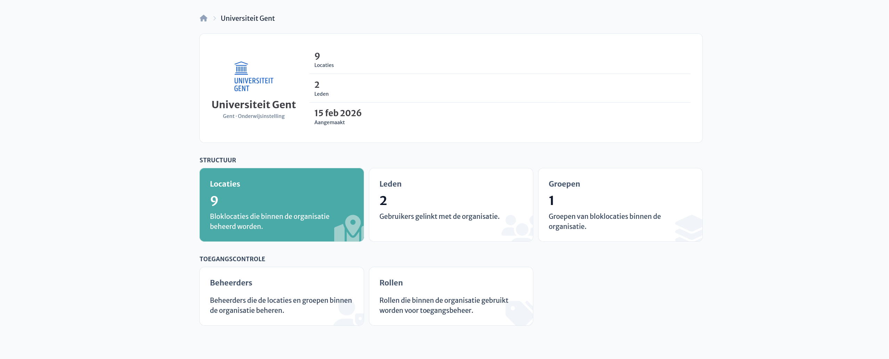

# Organisatiebeheerder

Als **organisatiebeheerder** beheer je een organisatie die meerdere locaties omvat (bv. een onderwijsinstelling).
Vanuit de organisatie kan je:

- locaties koppelen, aanmaken, en verwijderen
- leden beheren
- beheerders en rollen beheren
- groepen aanmaken en toegang toekennen

::: info
Organisaties kunnen gebruikt worden om beheer te centraliseren.
Organisatiebeheerders hebben automatisch toegang tot gekoppelde locaties.
:::

## Overzicht van beheerbare organisaties

Je vindt alle organisaties waartoe je beheerdersrechten hebt in de beheermodus op je profiel,
onder de rubriek 'Organisaties & Groepen'.

## Organisatiedashboard

Eens je op een beheerbare organisatie klikt kom je op het organisatiedashboard terecht.
Hier kan je de locaties, leden, groepen, beheerders, en rollen van de organisatie bekijken.
Het logo van de organisatie kan je veranderen door op het bestaande logo te klikken.

## Snelkoppelingen

- [Locaties beheren](./locations.md)
- [Leden beheren](./members.md)
- [Toegangsbeheer](./access/)
- [Groepen beheren](./authorities.md)
- [Toegang beheren](./institution-access.md)
