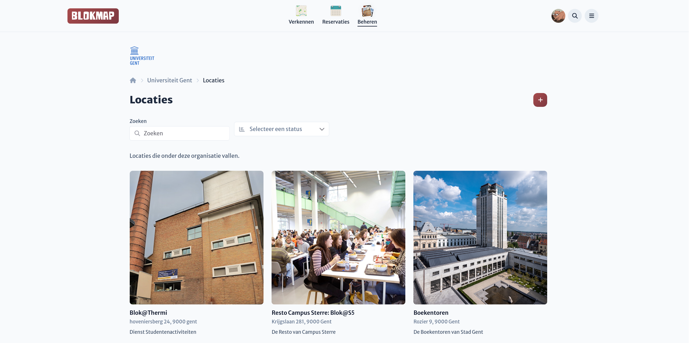

# Locaties beheren

Op deze pagina beheer je de locaties die aan een organisatie zijn gekoppeld.
Via de zoekbalk kan je zoeken op naam en/of omschrijving van de locatie,
of je kan via het dropdownmenu filteren op de status van de locatie.

Door op een locatie te klikken kom je terecht op het [locatiedashboard](/user/locations/location-dashboard#locatiedashboard)

## Locaties Aanmaken

Vanuit deze pagina kan je direct locaties onder een organisatie aanmaken door op de plus-knop rechtsboven te drukken.
Meer uitleg hierover vind je op de pagina over [locaties aanmaken](/user/locations/index).

## Locaties koppelen <Badge type="danger" text="TODO" />

Indien je ook beheerder van een locatie bent die nog niet onder een organisatie valt,
kan je deze ook koppelen via die TODO knop.
Hiermee komt de locatie

::: danger
Als de organisatie bepaalde restricties heeft over wie er kan reserveren kan het
zijn dat bestaande reservaties op deze locatie geannuleerd worden.
:::
