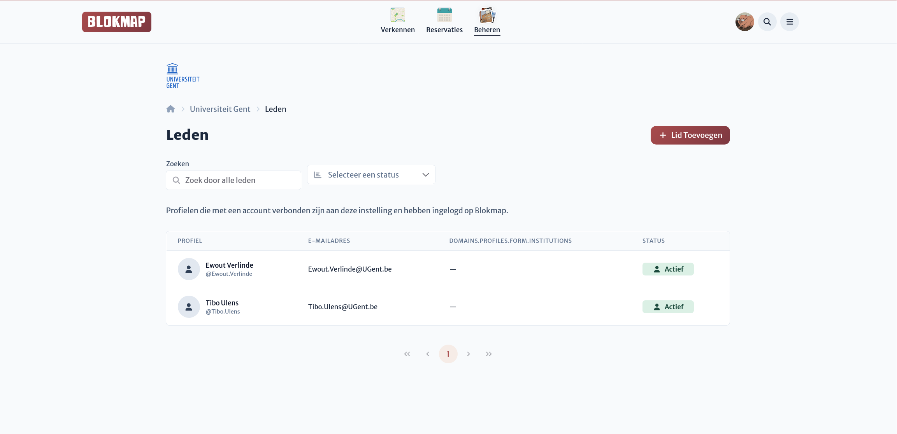
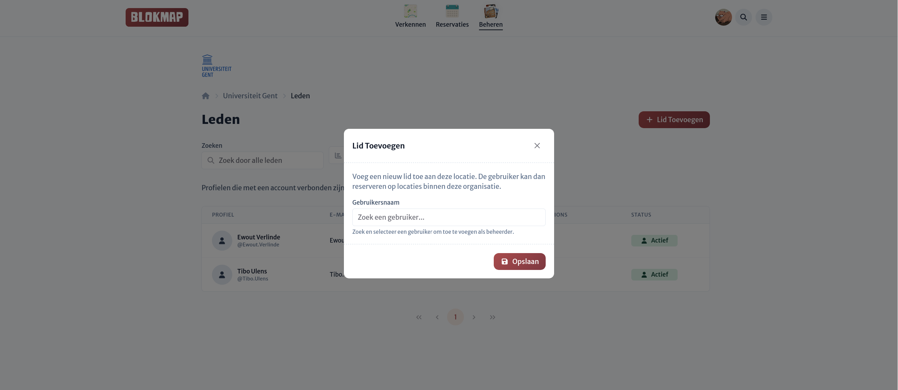

# Leden beheren

Op de leden pagina zie je een overzicht van welke gebruikers er allemaal 'lid' zijn van deze organisatie.
Lid zijn van een organisatie houdt in dat deze gebruikers ofwel manueel zijn toegevoegd als lid
of een externe account gerelateerd aan deze organisatie gekoppeld hebben met hun Blokmap account. \
bv. Een student die zijn UGent account gekoppeld heeft aan Blokmap.

Leden hebben an sich geen beheersrechten.

## Leden toevoegen

Je kan leden toevoegen door te zoeken op hun Blokmap-gebruikersnaam en ze te koppelen aan je organisatie.
Als de organisatie met een eigen login (bv. UGent account) werkt zou dit niet
nodig moeten zijn behalve om problemen op te lossen.

## Leden verwijderen <Badge type="danger" text="TODO" />

Verwijder leden wanneer ze geen deel meer uitmaken van de organisatie, zodat toegang en rechten correct blijven.
