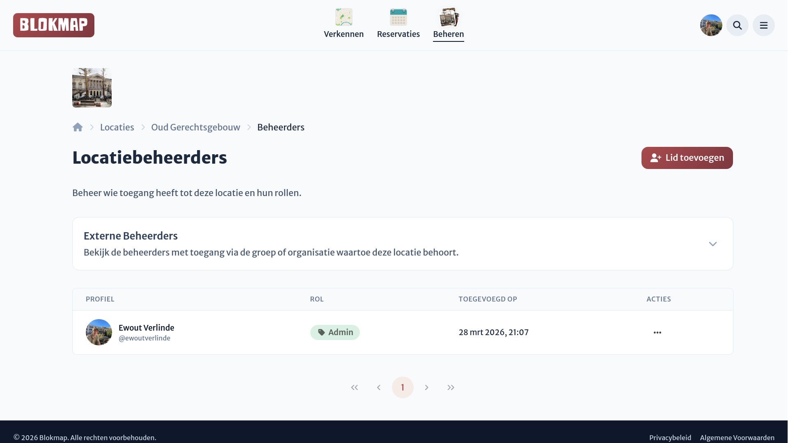
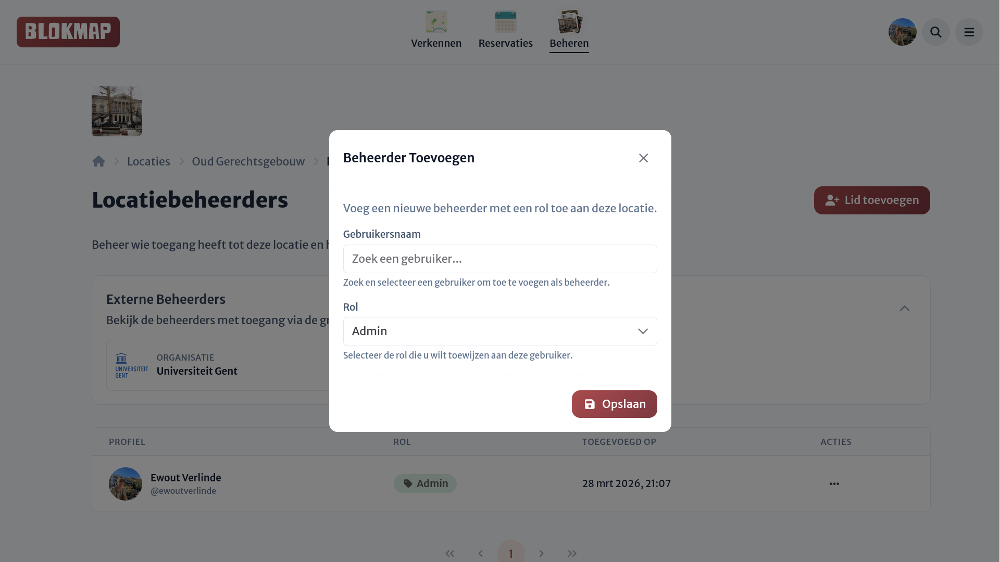
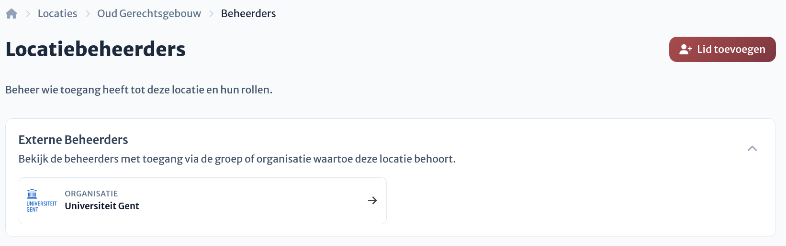

# Toegangsbeheer

Op de pagina voor toegangsbeheer krijg je een duidelijk overzicht van alle locatiebeheerders en hun bijbehorende rollen (met de bijpassende rechten). Vanuit dit overzicht is het eenvoudig om het beheer van je locatie te regelen.

## Beheerders toevoegen, aanpassen en verwijderen

Vanaf het overzicht kun je moeiteloos nieuwe personen als beheerder toevoegen. Via de knop rechtsboven open je een dialoogvenster:

1. **Zoeken**: Je kunt direct zoeken op de gebruikersnaam van de persoon binnen Blokmap.
2. **Rol toewijzen**: Ken direct een specifieke rol toe, of laat dit veld leeg als je de persoon later een rol wil geven.

Het is vanuit het overzicht ook eenvoudig om iemand weer uit het beheer te verwijderen, alsook hun rol aan te passen.

::: warning Rechten vereist
Je kunt alleen andere beheerders toevoegen of verwijderen als je eigen rechten of rol dit toelaten.
:::

## Externe beheerders (Organisaties)

Wanneer je locatie onder een overkoepelende organisatie (bv. een onderwijsinstelling) valt, hebben alle beheerders van die organisatie automatisch ook toegang tot jouw specifieke locatie.

Je kunt deze informatie raadplegen in het dropdown-menu **Externe beheerders**. Hier zie je de betreffende organisatie waar de locatie onder valt. Indien je zelf beheerder bent van deze organisatie, kan je verder doorklikken om de gebruikers te zien die de rechten op deze locatie overerven via de organisatie in kwestie.

