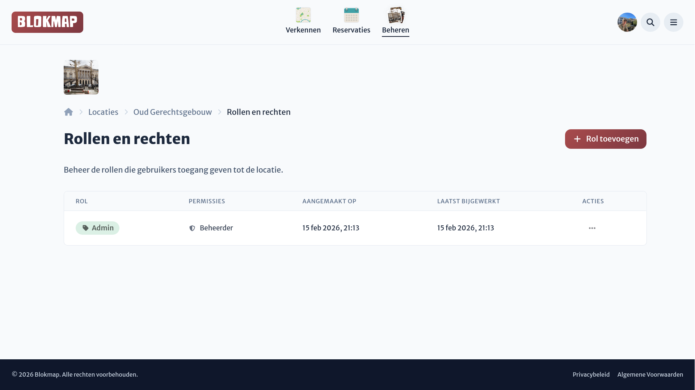
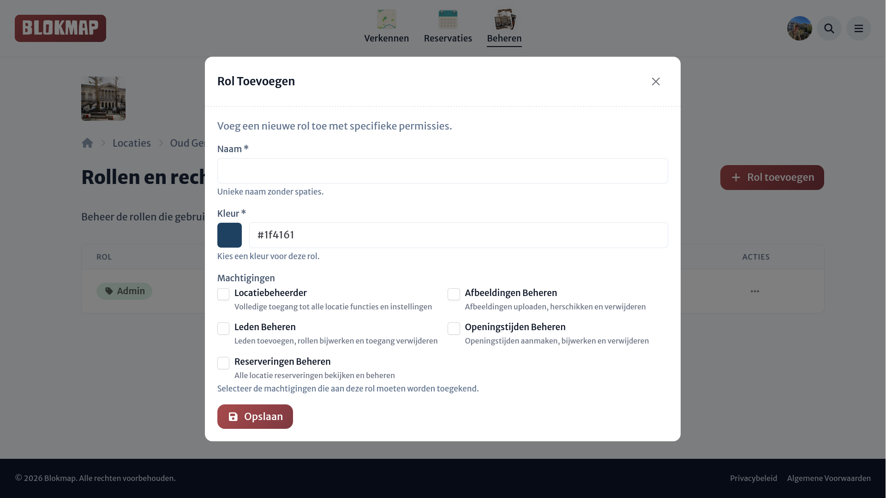

# Rollen en Rechten

Elke locatiebeheerder kan een optionele rol krijgen toegewezen. Op de rollen-pagina zie je een overzicht van alle beschikbare rollen voor jouw locatie.

Vanuit dit overzicht kun je eenvoudig rollen beheren. Wanneer je een rol verwijdert, wordt deze rol automatisch verwijderd bij iedereen (elke beheerder) die deze rol op dat moment had toegewezen gekregen.

:::tip Belangrijk
Elke locatie heeft `Admin` als standaardrol. Deze rol kan niet verwijderd of aangepast worden.
:::

## Een nieuwe rol aanmaken

Via de knop rechtsboven kun je, vergelijkbaar met het beheerdersoverzicht, een nieuwe rol toevoegen. In het dialoogvenster voor rollen kun je de volgende zaken instellen:

- **Naam**: Een duidelijke en herkenbare naam voor de rol.
- **Badgekleur**: Een kleur om de rol snel visueel te herkennen in het beheerdersoverzicht.
- **Rechten**: De specifieke permissies die aan deze rol gekoppeld worden.

::: info Work in progress
Het systeem voor de gedetailleerde (daadwerkelijke) rechten wordt momenteel herwerkt en is voorlopig nog _work in progress_.
:::
