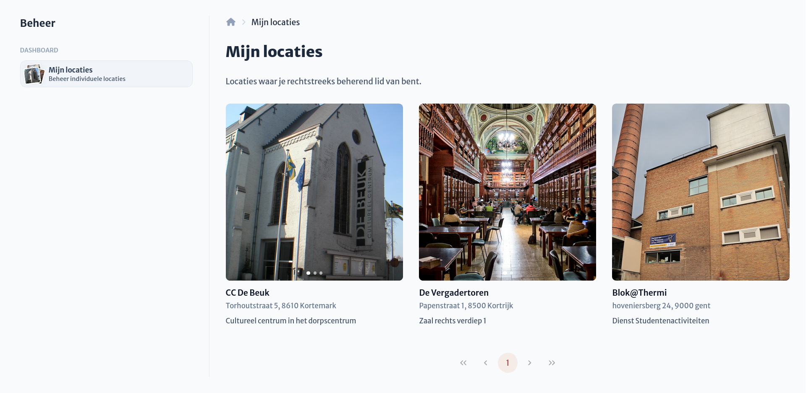
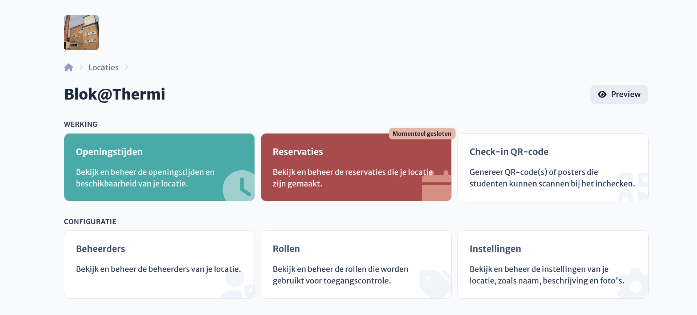

# Dashboard & Overzicht

## Overzicht van beheerbare locaties

Je vindt alle locaties waartoe je beheerdersrechten hebt in de beheermodus op je profiel.
Deze lijst omvat locaties waar je rechtstreeks als beheerder werd toegevoegd, samen met alles locaties waartoe je onrechtstreeks toegang hebt via een organisatie.

## Locatiedashboard

Via de beheerdermodus heb je als locatiebeheerder toegang tot het locatiedashboard. Klik simpelweg op een locatie voor een handig overzicht van alle bijbehorende instellingen. Via de knop rechtsboven bekijk je eenvoudig hoe de locatie wordt getoond aan studenten die willen komen studeren.

