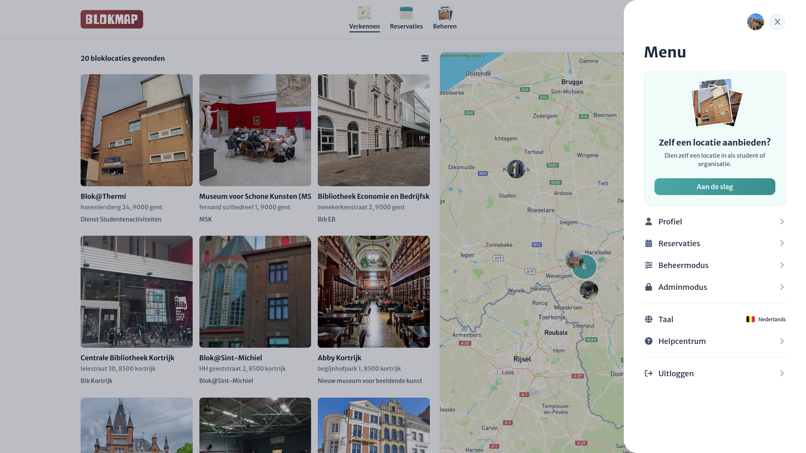
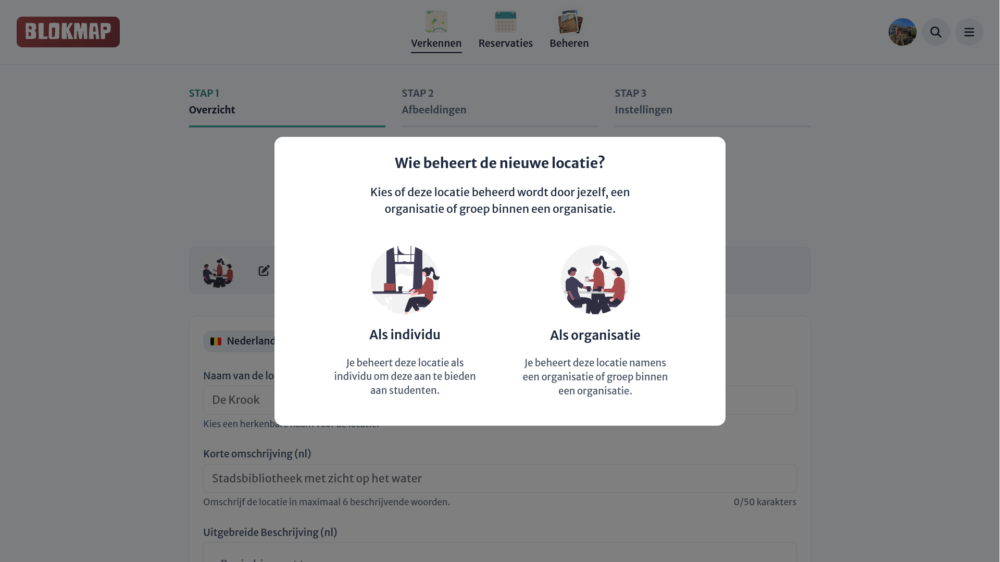
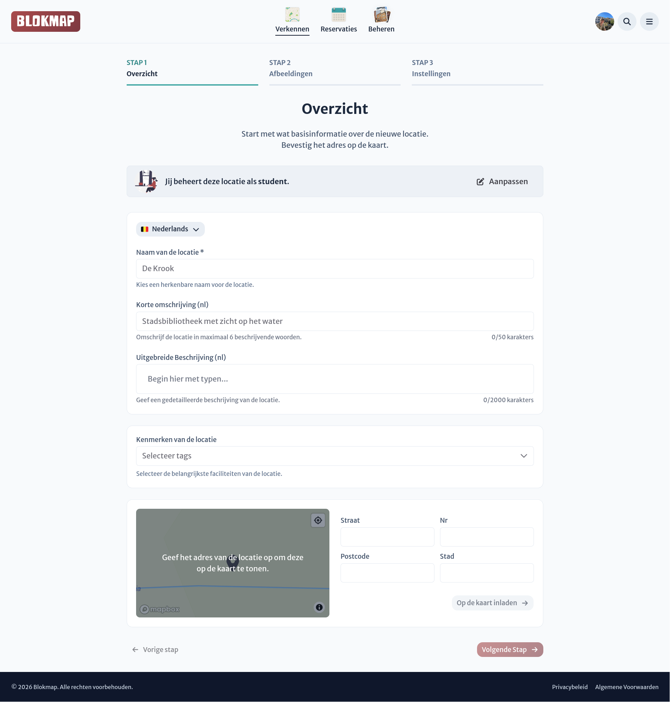

# Locatie aanmaken

::: info
Nieuwe bloklocaties moeten na aanmaak altijd eerst worden goedgekeurd door een Blokmap-beheerder. Zo voorkomen we misbruik van het platform. Meestal duurt dit maximaal een paar uur.
:::

Met de locatie-wizard maak je snel en eenvoudig een nieuwe locatie aan. Je wordt stap voor stap begeleid bij het invullen van de basisinformatie voor je nieuwe bloklocatie.

Je kan de wizard makkelijk openen via de sidebar wanneer je op het menu rechtsboven in de navigatiebalk klikt:

Tijdens de creatie kun je ervoor kiezen om de locatie **individueel** aan te maken of te koppelen onder een **organisatie** (indien je organisatiebeheerder bent):

De wizard zelf bestaat uit 3 stappen, waar we vragen de algemene informatie (oa.naam, beschrijvingen, locatie op de kaart...), de afbeeldingen, en de algemene instellingen (o.a. zichtbaarheid, reservatie-instellingen...) in te vullen.

## 1. Overzicht

<!--@include: ./partials/general.md-->

## 2. Afbeeldingen

<!--@include: ./partials/images.md-->

## 3. Algemene instellingen

<!--@include: ./partials/advanced.md-->

Na het aanmaken van een nieuwe locatie heb je meteen toegang tot het [locatiedashboard](./dashboard-overview.md), waar je de locatie verder kan instellen (o.a. **openingsuren** en **toegangscontrole**).
