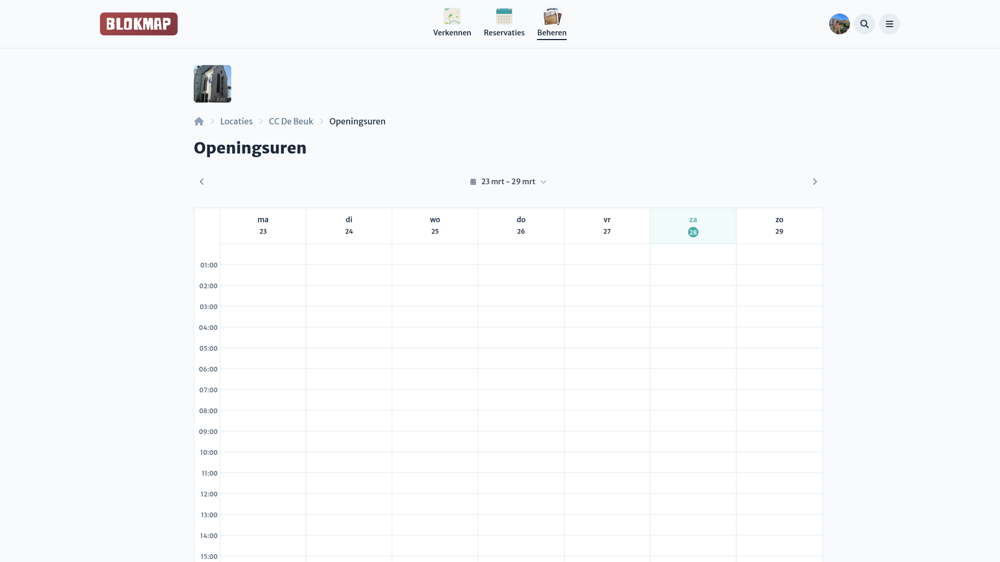
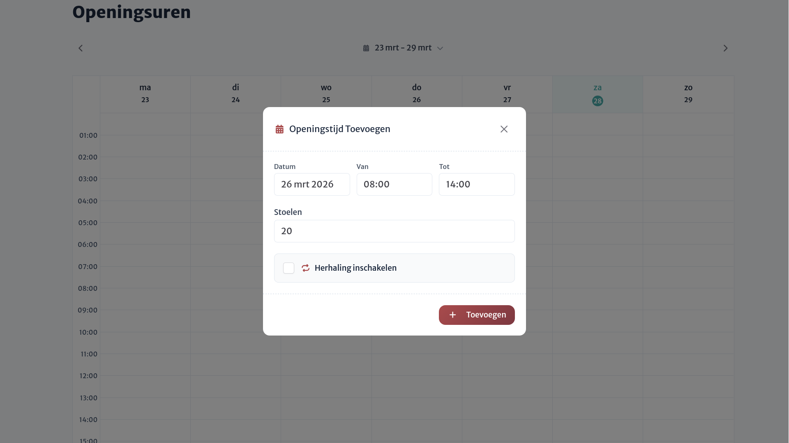

# Enkele openingstijden

Op het locatie-dashboard beheer je eenvoudig de specifieke openingstijden via een ingebouwde, overzichtelijke kalender-interface. Dit is bedoeld voor het vastleggen van de dagen en uren waarop je locatie geopend is.

## Openingsuren toevoegen

Je kunt een tijdslot in deze kalender aanklikken om het dialoogvenster te openen voor het aanmaken van een nieuwe openingstijd. In dit dialoogvenster wordt de starttijd van het slot waarop je hebt geklikt automatisch toegevoegd.

Je kunt de volgende instellingen aanpassen:

- **Dag, start- en eindtijd**
- **Reservatieperiode**: Je kan instellen vanaf/tot **wanneer** mensen reservaties kunnen maken voor de openingstijd.
- **Zitplaatsen**: Standaard is het aantal geconfigureerde zitplaatsen voor de locatie vooraf ingevuld. Je kan dit desgewenst voor deze openingstijd hier aanpassen.

::: tip Reservaties per blok
Wanneer je voor je locatie **reservaties** hebt ingeschakeld, functioneert elke afzonderlijke openingstijd-blok als één te reserveren tijdslot. Wil je bijvoorbeeld dat studenten per 2 uur reserveren in plaats van één aaneengesloten periode van 8 uur? Maak dan meerdere afzonderlijke openingstijden (blokken van 2 uur) op één dag aan in plaats van één grote blok.
:::

## Openingsuren aanpassen of verwijderen

Het verwijderen en aanpassen van een openingstijd kan eenvoudig gebeuren door in de kalender op een bestaande openingstijd te klikken. Hier kun je vervolgens de dag, uren en de beschikbare plaatsen bewerken.
