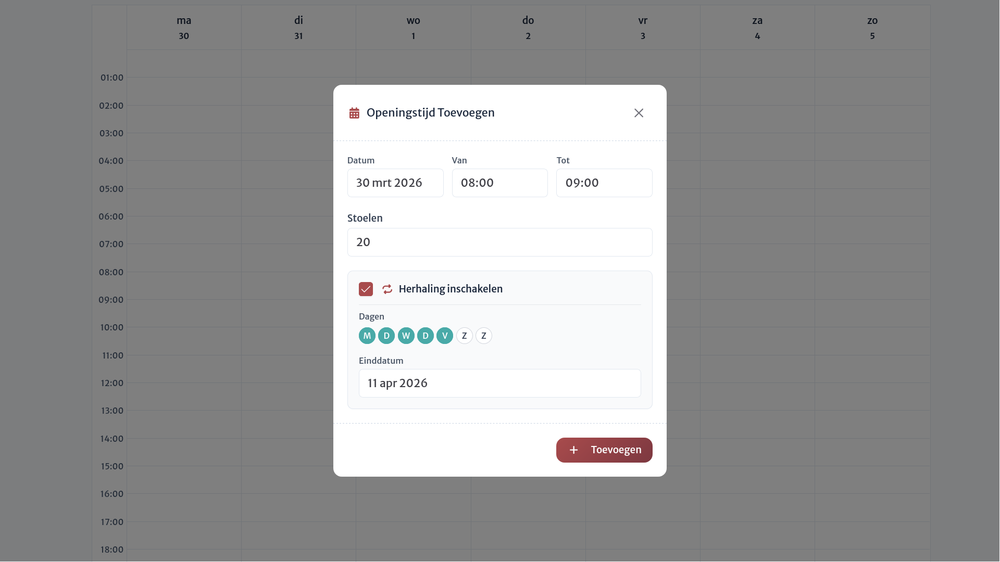
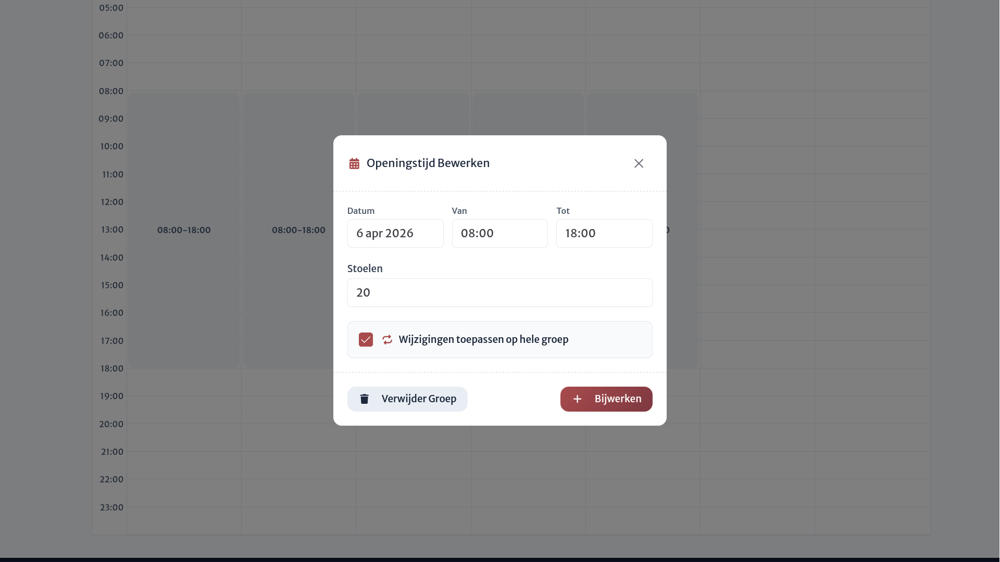

# Herhalende openingstijden

Binnen grotere locaties is het efficiënter om openingstijden niet dag per dag in te voeren. Daarom biedt Blokmap functionaliteit voor herhalende (repeterende) openingstijden.

## Herhaling instellen

Tijdens het creëren of bewerken van een openingstijd, kun je via een handig vinkje ervoor kiezen om herhaling te configureren voor die periode.

Nadat je deze optie aanvinkt, selecteer je op welke **weekdagen** de herhaling actief moet zijn en **tot welke datum** deze herhaald moet worden. Nadat je de instellingen bewaart, creëert het systeem vervolgens volautomatisch openingstijden met vergelijkbare instellingen voor elke dag van de geselecteerde weekdagen tot en met de gekozen einddatum.

## Herhalingen aanpassen en verwijderen

Wanneer je een openingstijd uit de kalender aanklikt, kan je deze opnieuw bewerken. Als de geselecteerde openingstijd oorspronkelijk werd aangemaakt op basis van een herhaling, kan je ervoor kiezen om alle wijzigingen toe te passen op de volledige herhalende reeks (bijvoorbeeld om het aanvangsuur en einduur of de zitplaatsen te wijzigen) of de gehele reeks te verwijderen.

::: warning Ontkoppelen van een reeks
Als je een specifieke openingstijd binnen een reeks aanpast, maar je kiest er bewust voor om deze update **niet** toe te passen op de volledige reeks, dan wordt deze openingstijd definitief losgekoppeld van die herhalende reeks.
:::
