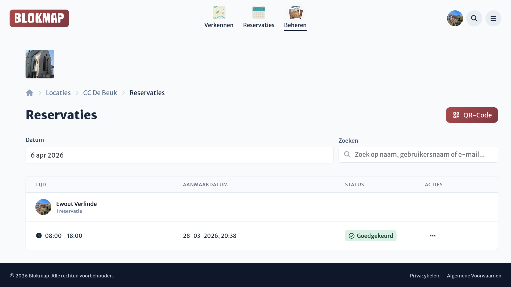
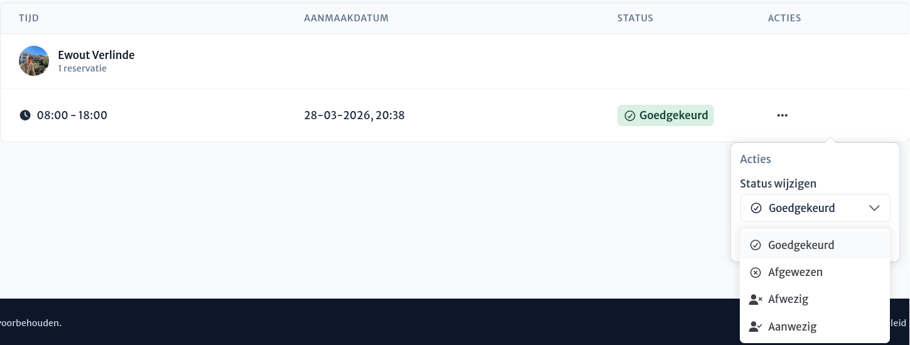

# Reservaties beheren

Op het locatie-dashboard vind je het reservatie-overzicht. Hier kun je eenvoudig bijhouden wie er op een specifieke dag een reservatie heeft voor jouw locatie. Standaard toont dit overzicht de reservaties van vandaag, maar je kunt eenvoudig de kalender gebruiken om een andere dag te selecteren.

In het overzicht zie je een overzichtelijke tabel met alle gereserveerde personen voor de geselecteerde dag. Je kunt tevens een zoekfunctie gebruiken om snel specifieke mensen terug te vinden. Per persoon (profiel) zie je de start- en eindtijd van hun reservatie en de huidige status.

## Statussen van een reservatie

Elke reservatie doorloopt verschillende statussen. Je kunt in de tabel de volgende statussen tegenkomen:

- **Goedgekeurd**: De reservatie is geldig en bevestigd. De bezoeker wordt op de locatie verwacht.
- **Afgewezen**: De persoon heeft geprobeerd een reservatie te maken, maar deze is niet doorgegaan. Dit kan gebeuren omdat de inschrijvingswachtrij vol is bereikt of omdat een beheerder deze handmatig heeft geweigerd.
- **Aanwezig**: De bezoeker heeft zijn of haar aanwezigheid correct bevestigd op de locatie.
- **Afwezig**: De bezoeker had in eerste instantie een goedgekeurde reservatie, maar is niet tijdig komen opdagen of heeft zijn aanwezigheid niet bevestigd.

## Handmatig statussen aanpassen

Hoewel we bezoekers stimuleren om dit zoveel mogelijk zelf te doen (zie [Aanwezigheid via QR-codes](./qr-codes.md)), kun je als beheerder via het actie-menu (de dropdown aan de rechterkant van elke reserveringsregel) de status van een reservatie handmatig bijwerken. Dit is in het bijzonder handig als je bijvoorbeeld zeker weet dat iemand er is en je de studenten handmatig op **Aanwezig** wilt zetten om de aanwezigheid handmatig te bevestigen.

