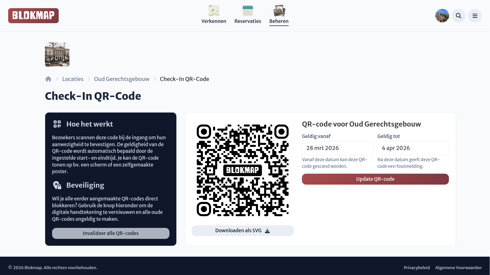

# Aanwezigheid via QR-codes

In de meeste gevallen willen we dat studenten zelfstandig hun aanwezigheid bevestigen wanneer ze op de locatie aankomen. Hiervoor biedt Blokmap de mogelijkheid om een unieke QR-code te genereren voor de locatie.

## Hoe het werkt

Vanuit de QR-code pagina kun je eenvoudig een nieuwe locatie-specifieke QR-code genereren. Deze code kan je direct downloaden als een **SVG-bestand**. Deze digitale afbeelding kun je overal inzetten:

- Afgedrukt op een zelfgemaakte poster of infofolder bij de de ingang.
- Weergegeven op een digitaal e-ink scherm of een tv-monitor op locatie.

Mensen kunnen zich vervolgens met hun telefoon aanmelden door deze QR-code simpelweg te scannen op de locatie.

## Misbruik voorkomen en flexibiliteit

Regelmatig opduikend probleem is dat studenten een foto nemen van een QR-code om deze aan vrienden door te sturen. Blokmap biedt verscheidene tools en veel flexibiliteit om dit tegen te gaan:

- **Scan-venster instellen**: Het registreren via deze QR-codes werkt uitsluitend binnen een specifiek, afgebakend tijdslot. Dit "scan-venster" stel je in via de [geavanceerde instellingen](../settings/advanced.md) van de locatie.
- **Geldigheidsperiode bepalen**: Bij de aanmaak van een nieuwe QR-code kun je precies definiëren per wanneer én tot wanneer deze mag werken (een start- en einddatum).
- **QR-codes intrekken**: Merk je dat er misbruik is opgemerkt, of is de blokperiode voorbij? Via een druk op de knop in het QR-dashboard deactiveer (of invalideer) je meteen alle eerder gemaakte QR-codes voor jouw gebouw.

### Gebruiksvoorbeelden

Deze instellingen zorgen ervoor dat je zélf de toegangscontrole kan bouwen die past bij de flow van jouw locatie:

- **Veilige controle**: Plaats een medewerker aan de ingang van het gebouw die de QR-code toont op een tablet of scherm. Bezoekers kunnen na de inloopmomenten de controle niet meer proberen te misleiden.
- **Postersysteem**: Hang doorheen het gebouw posters met de code. Maak de codes periodiek onklaar en druk wekelijks een andere QR-code af voor de posters.
