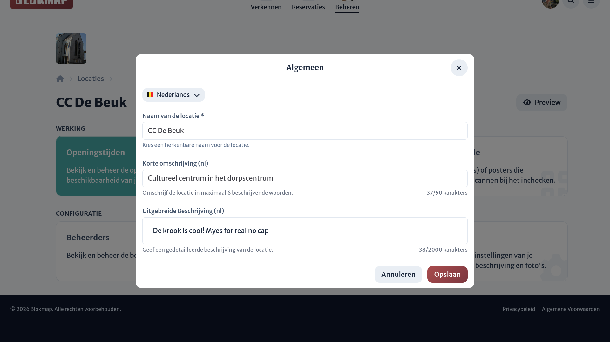

# Algemene gegevens

Via de instellingenpagina in het dashboard kun je de basisinformatie van je locatie beheren. Dit is de informatie die het meest zichtbaar is voor de buitenwereld.

<!--@include: ../partials/general.md-->
