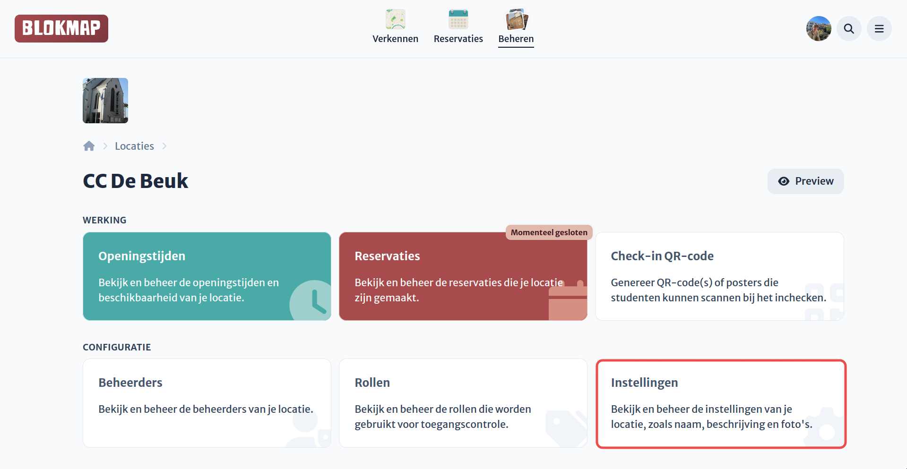

# Locatie instellen

Hier kun je de instellingen aanpassen die je eerder hebt geconfigureerd tijdens de creatie van de locatie. Navigeer in het dashboard naar het instellingen menu voor je locatie.

Hieronder vind je alle specifieke aspecten die je kunt beheren. Deze kun je direct in de zijbalk terugvinden of hieronder aanklikken.

- [Algemene gegevens](./general.md)
- [Afbeeldingen](./images.md)
- [Geavanceerde instellingen](./advanced.md)
